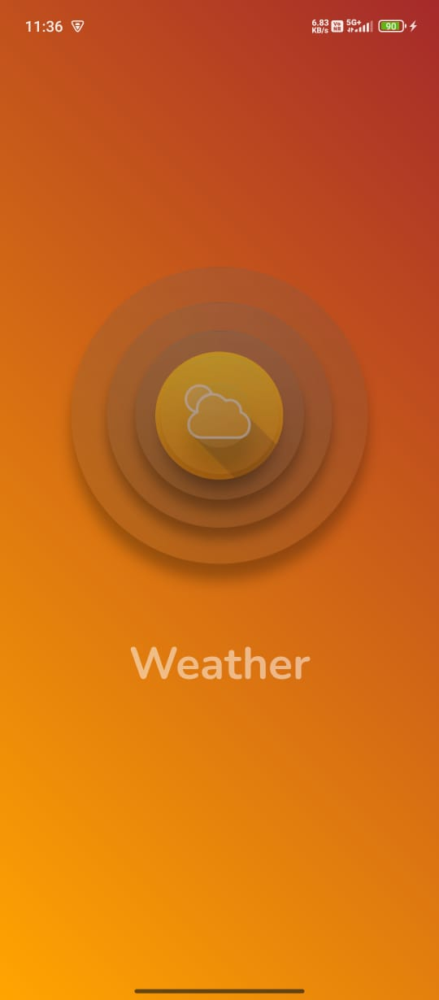
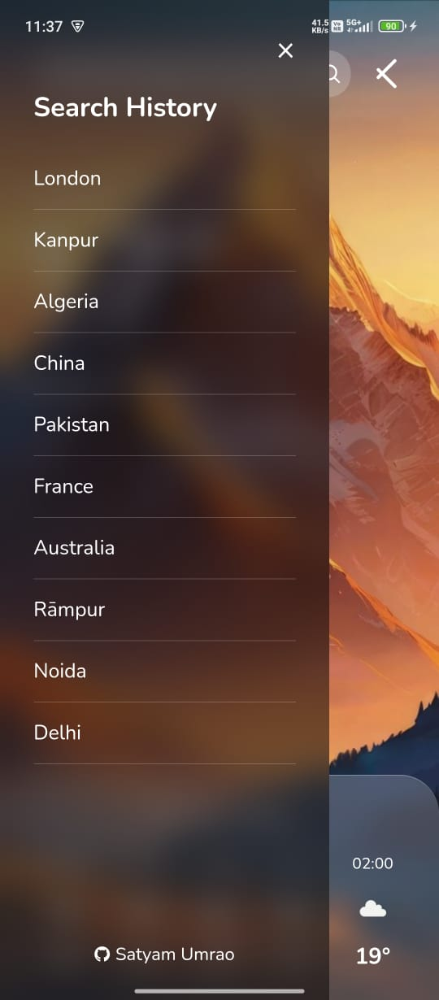
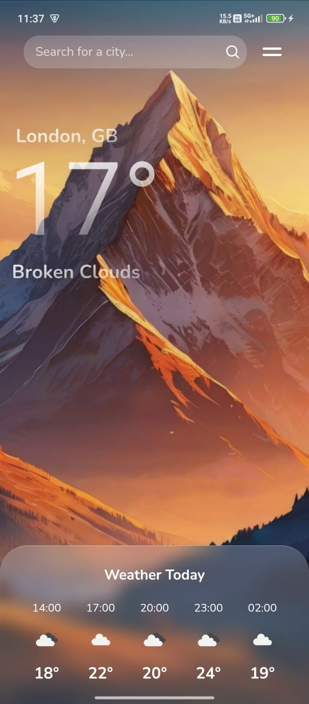

# 🌤 Weather App

A clean, modern, and user-friendly weather application that provides accurate weather updates for locations around the world. Built with a beautiful UI and easy navigation to check weather conditions in just a few taps!

## 📲 Features

- 🌍 **Global City Search:** Find weather data for any city worldwide.
- ⏱ **Hourly Forecast:** Stay updated with hourly temperature and conditions.
- 📌 **Search History:** Quickly revisit recently searched locations.
- 🌄 **Dynamic UI:** Backgrounds change according to weather and time of day.
- ⚡ **Lightweight & Fast:** Smooth performance with minimal battery usage.

## 🚀 Screenshots

| Splash Screen | Search History | Weather Details |
|--------------|----------------|----------------|
|  |  |  |

## 🛠 Tech Stack

- **Platform:** Android APK
- **Languages:** HTML, CSS, JavaScript (if using hybrid frameworks like Cordova/React Native)
- **API:** OpenWeatherMap API 

## 📥 Download

> 👉 [Download the APK](https://your-download-link.com) (Under progress)

## 💡 How to Use

1. Install the APK on your Android device.
2. Open the app and search for any city.
3. View current temperature, sky condition, and hourly forecast.
4. Switch between locations easily using search history.

## 🤝 Contributing

Feel free to fork this repository, submit issues, or create pull requests to help improve the app!

---

### Author

Made with ❤️ by **Satyam Umrao**
